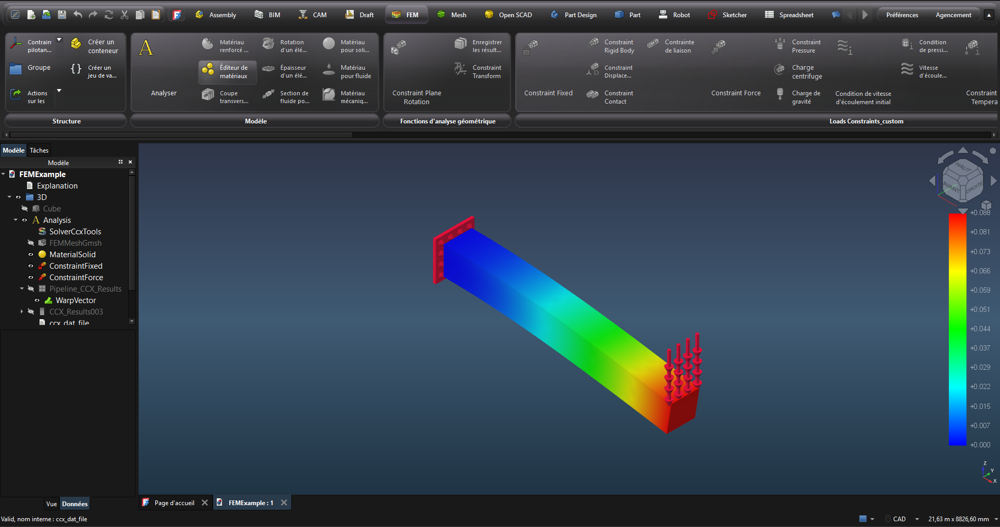

## CommandTab UI

FreeCAD CommandTab is a native-first ribbon UI addon for FreeCAD.

- UI shell, layout and dialogs are implemented in native Qt/C++ (`freecad_commandtab/native/cpp`)
- Python is kept for FreeCAD addon bootstrap (`InitGui.py`) and bridge/orchestration only

<p align="center">
  
</p>

Current project status and macOS handover notes are tracked in
[`PROJECT_STATUS.md`](./PROJECT_STATUS.md).

## Runtime Model

Native mode is the only supported UI runtime.

Activation:

1. Create a `FREECAD_COMMANDTAB_NATIVE` marker file in the addon root, or
1. Set `FREECAD_COMMANDTAB_NATIVE=1` before launching FreeCAD, or
1. Set `PreferNativeCommandTab=true` in FreeCAD parameters.

Native binaries are loaded from:

- `freecad_commandtab/native/bin/<platform>/qt<major>/`
- `<platform>`: `linux`, `windows`, `macos` (`darwin` is accepted as alias)

Runtime user data is stored in user-scoped FreeCAD paths (`CommandTabStructure.json`, metadata cache, startup diagnostics).

## Developer Quick Start

### 1. Prerequisites

- Python 3.11+
- CMake 3.21+
- C++17 toolchain
- Qt5 or Qt6 with modules: `Core`, `Gui`, `Widgets`, `Svg`

### 2. Build the native backend

Use the cross-platform helper to build and package the native backend for the current host platform:

```bash
python tools/build_and_package_local.py --qt-major 6
```

On Windows, build with the same MSVC/Qt family used by FreeCAD. Mixing a
MinGW-built DLL with a FreeCAD MSVC Qt runtime can produce missing-entry-point
errors when the addon starts. The PowerShell wrapper is the simplest entry
point when the local Qt/CMake paths are already configured:

```powershell
./tools/build_and_package_local.ps1 --native-platform windows --qt-major 6
```

If you need to target a specific Qt version or platform manually, you can still use CMake directly:

```bash
cmake -S freecad_commandtab/native/cpp -B build/native-linux-qt6 \
  -DFREECAD_COMMANDTAB_QT_MAJOR_VERSION=6 \
  -DFREECAD_COMMANDTAB_NATIVE_OUTPUT_DIR="$(pwd)/freecad_commandtab/native/bin/linux/qt6"
cmake --build build/native-linux-qt6 --parallel
```

For macOS, output to `freecad_commandtab/native/bin/macos/qt6` and ensure the
built `.dylib` links against FreeCAD.app's bundled Qt libraries.

For Qt5, use `--qt-major 5` or `-DFREECAD_COMMANDTAB_QT_MAJOR_VERSION=5` and
output to `.../qt5`.

The original shell helper remains available for bash-based workflows and now
detects the host Python interpreter automatically:

```bash
./tools/build_and_package_local.sh
```

### 3. Run static checks

```bash
python3 -m pytest -q
python3 -m compileall -q .
python3 tools/verify_native_matrix.py
```

To verify the currently shipped Linux, macOS and Windows Qt6 deliverables:

```bash
python3 tools/verify_native_matrix.py --platform linux --platform macos --platform windows --qt qt6
```

### 4. Build a distributable addon folder

```bash
python3 tools/package_addon.py --output dist/CommandTab
```

This packaging step now also creates the `FREECAD_COMMANDTAB_NATIVE` marker file in the addon root so native mode is enabled automatically when the addon is installed.

Optional Qt6 release check (Linux/Windows/macOS):

```bash
python3 tools/verify_native_matrix.py --root dist/CommandTab/freecad_commandtab/native/bin --platform linux --platform macos --platform windows --qt qt6 --require-full-matrix
```

### 4b. Build a single multi-OS addon via GitHub Actions

Run workflow `.github/workflows/native-matrix-build.yml` (`workflow_dispatch`), or push a `v*` tag.

It will:

- build Qt6 native backends for `linux` x64, `windows` x64 and `macos` Apple Silicon
- assemble them into one addon tree under `freecad_commandtab/native/bin/<platform>/qt<major>/`
- verify the Qt6 matrix completeness
- upload both `FreeCAD-CommandTab-multi-os-qt6` and `FreeCAD-CommandTab-multi-os-qt6.zip`

### 5. Install locally for FreeCAD

Copy `dist/CommandTab` to your FreeCAD `Mod` directory and restart FreeCAD.

## Project Structure

- `InitGui.py`: FreeCAD entrypoint and startup orchestration
- `freecad/CommandTab/init_gui.py`: FreeCAD 1.1 namespace entrypoint
- `freecad_commandtab/native/bootstrap.py`: startup policy, native attach, runtime diagnostics
- `freecad_commandtab/native/bridge.py`: Python/C++ bridge (ctypes), metadata, refresh flows
- `freecad_commandtab/native/cpp`: native UI/runtime sources
- `tools/package_addon.py`: clean packaging script
- `tools/verify_native_matrix.py`: native binary matrix validation

## Troubleshooting

- If the ribbon does not appear, check `FREECAD_COMMANDTAB_NATIVE_STATUS.json` in the user cache.
- Verify the backend binary exists for the host platform/Qt version under `freecad_commandtab/native/bin/...`.
- Ensure `FREECAD_COMMANDTAB_NATIVE` marker file is present in the installed addon directory.
- On macOS, if translations or icons look stale, clear the CommandTab cache under `~/Library/Application Support/FreeCAD/v1-1/Cache/FreeCAD-CommandTab/` and restart FreeCAD.

## Installation

### Install via Addon Manager

Once this repository has been accepted into the FreeCAD Addon Index:

1. Open FreeCAD Addon Manager.
1. Search `FreeCAD-CommandTab`.
1. Click `Install` and restart FreeCAD.

## Publishing

Before publishing a fork for Addon Manager review:

1. Push this repository to a public GitHub repository.
1. Add the repository topics `freecad` and `addon`.
1. Verify `package.xml` points to `https://github.com/emilecachot/FreeCAD-CommandTab`.
1. Keep the prebuilt native runtime files in `freecad_commandtab/native/bin/<platform>/qt<major>/`.
1. Do not commit `build/`, `dist/`, local Qt SDKs, debug symbols, import libraries, or old MinGW runtime DLLs.
1. Follow [`docs/ADDON_MANAGER_SUBMISSION.md`](./docs/ADDON_MANAGER_SUBMISSION.md) when creating the FreeCAD Addon Index request.

## Discussion

Forum thread: https://forum.freecad.org/viewtopic.php?t=91353

## License

`LGPL-3.0-or-later` (see [LICENSE](./LICENSE)).
